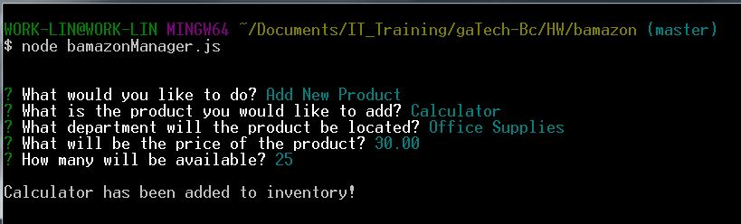

# Bamazon

## Description

An Amazon-like storefront CLI based node app. The app takes in orders from customers. The app also takes in orders from managers, and deplete stock from the store's inventory. MySQL is used as the database to hold products info.

### Data
The data is stored in a SQL database. Each product has a category:

   * item_id (unique id for each product)

   * product_name (Name of product)

   * department_name

   * price (cost to customer)

   * stock_quantity (how much of the product is available in the store)

### Customer interface

When the user runs `node bamazonCustomer.js`, all the items available for sale will display. Each product is categorized by id, name and price. The app then asks the user for the ID of the product they would like to buy

Once the user enters an ID for an item, the app then asks the user how many units of the product they would like to buy.
If the quantity requested from the user is less than or equal to the stock quantity, the app fulfills the user order. This is confirmed by the app displaying the user's total cost of their purchase.

If the quantity requested from the user is greater than the stock quantity, the app returns a message informing the user that there is an insufficient quantity.

### Manager interface

When the user runs `node bamazonManager.js`, The following list of menu options will display:

  * View Products for Sale
    
  * View Low Inventory
    
  * Add to Inventory
    
  * Add New Product

If the user selects `View Products for Sale`, the app will list every available products' item IDs, names, prices, and quantities.

If the user selects `View Low Inventory`, then it should list all products with an inventory count lower than five. 

If there are no products with inventory count less that five, the app returns message to user stating that all products are sufficiently stocked

If the user selects `Add to Inventory`, the app displays a prompt that will let the user "add more" of any item currently in the store. The app prompts the user to specify by ID the product they would like to increase. The app then prompts the user to provide the specific number to increase the quantity by. Once the user provides those values, the app returns a message informing the user that the product quantity has been succesfully increased.

If the user selects `Add New Product`, it allows them to add a completely new product to the store. It prompts the user for each of the following categories:

   * The name of the product

   * The Department the product is classified under

   * The price of the product

   * How much of the product will be available

   